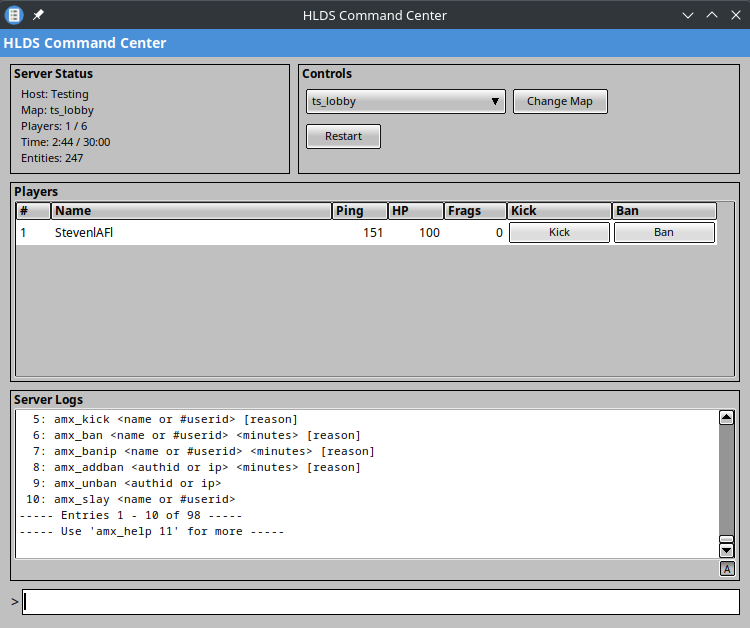

# metamod-gui

A Metamod plugin that provides a graphical server administration interface for Half-Life dedicated servers. Built with FLTK for a lightweight, native GUI experience.

## Features

- **Server Status Panel** - Real-time display of hostname, current map, player count, server time, and entity count
- **Map Controls** - Dropdown selection from mapcycle.txt with quick change and restart buttons
- **Player Management** - Table view of connected players with per-player Kick and Ban buttons
- **Server Logs** - Scrollable, selectable log display with auto-scroll toggle
- **Command Input** - Direct console command execution

## Screenshots



## Requirements

- Docker (for building)
- Half-Life dedicated server (HLDS) or compatible source port
- Metamod installed on the server

## Building

### 1. Build the Docker image

```bash
./build-docker.sh
```

### 2. Build the plugin

```bash
# Build both x86 and x64
./build.sh

# Build only x86 (for classic HLDS)
METAMOD_GUI_ARCH=x86 ./build.sh

# Build only x64 (for 64-bit source ports)
METAMOD_GUI_ARCH=x64 ./build.sh
```

Output files:
- `./build-x86/Debug/bin/libmetamod-gui.so`
- `./build-x64/Debug/bin/libmetamod-gui.so`

## Installation

1. Copy `libmetamod-gui.so` to your mod's addons directory:
   ```
   <mod>/addons/metamod-gui/dlls/libmetamod-gui.so
   ```

2. Add to your `metamod/plugins.ini`:
   ```
   linux addons/metamod-gui/dlls/libmetamod-gui.so
   ```

3. Start your server. The GUI window will appear automatically.

## Directory Structure

```
metamod-gui/
├── assets/
│   └── icon.svg          # Application icon source
├── src/
│   ├── fltk_gui.cpp      # Main GUI implementation
│   ├── fltk_gui.hpp      # GUI class declarations
│   ├── player_table.cpp  # Player list table widget
│   ├── player_table.hpp  # Player table declarations
│   ├── meta_api.cpp      # Metamod plugin interface
│   ├── dllapi.cpp        # Game DLL hooks
│   ├── engine_api.cpp    # Engine hooks
│   └── h_export.cpp      # Plugin exports
├── vcpkg_ports/          # Custom vcpkg ports for hlsdk/metamod
├── build.sh              # Main build script
├── build-docker.sh       # Docker image build script
├── Dockerfile            # Build environment definition
└── CMakeLists.txt        # CMake configuration
```

## Technical Details

- **GUI Toolkit**: FLTK 1.3 with Gleam theme
- **Architectures**: x86 (32-bit) and x64 (64-bit)
- **Dependencies**: Statically linked for maximum compatibility
- **Build System**: CMake with vcpkg for SDK dependencies

## License

This project is licensed under the [GNU General Public License v3.0](LICENSE).

### Third-Party Licenses

- **FLTK** - LGPL v2 with static linking exception
- **X11 libraries** - MIT/X11 License
- **Half-Life SDK** - Valve SDK License (free distribution only)
- **Metamod-R** - GPL v3

This software is based in part on the work of the FLTK project (https://www.fltk.org).
